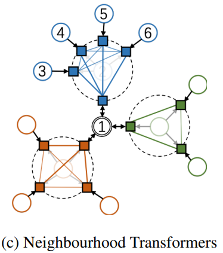

# Monophilic Neighbourhood Transformers

## Abstract

Inspired by the universal monophily in real-world graphs, a characteristic where a node tends to be related to the neighbours of its neighbours, we propose Neighborhood Transformers (NT).
NT employs self-attention within every neighborhood of the graph to generate informative messages for the nodes within, as opposed to the central node in conventional GNN frameworks.
We develop a neighbourhood partitioning strategy equipped with switchable attentions, applying linear attention for efficiency and switching to full-rank attention for accuracy, with a shared set of model parameters.
Experimental results on node classification tasks across 5 heterophilic and 5 homophilic graphs demonstrate that NT outperforms current state-of-the-art methods.

## Node Classification Performance

| Dataset          | Graph Type   | SotA method | SotA Accuracy | **NT Accuracy** |
|------------------|--------------|-------------|---------------|-----------------|
| Roman Empire     | Heterophilic | DIR-GNN     | 91.23         | **94.77**       |
| Amazon Ratings   | Heterophilic | GraphSAGE   | 53.63         | **54.25**       |
| Minesweeper      | Heterophilic | GAT-sep     | 93.91         | **97.42**       |
| Tolokers         | Heterophilic | GAT-sep     | 83.78         | **85.24**       |
| Questions        | Heterophilic | FSGNN       | **78.86**     | 78.46           |
| Amazon Computer  | Homophilic   | OrderedGNN  | 92.03         | **92.61**       |
| Amazon Photo     | Homophilic   | OrderedGNN  | 95.10         | **96.12**       |
| Coauthor CS      | Homophilic   | GGCN        | 95.25         | **96.07**       |
| Coauthor Physics | Homophilic   | GGCN        | 97.07         | **97.32**       |
| WikiCS           | Homophilic   | OrderedGNN  | 79.01         | **80.04**       |

## Reproducing SotA Results

See [reproduce.sh](reproduce.sh).

## Citation
